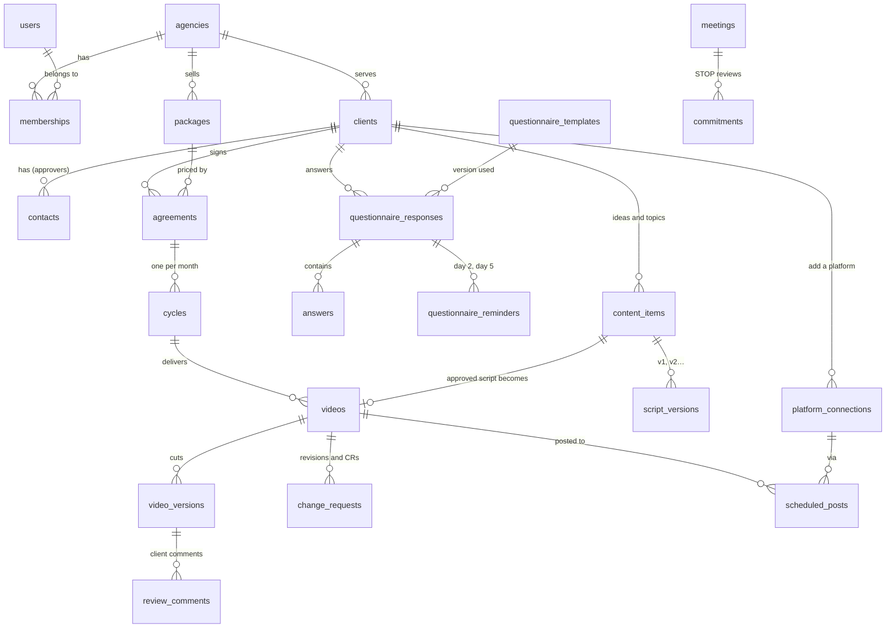

# Database design v0

Draft for team review (Phase 0). Source of truth: [`packages/db/prisma/schema.prisma`](../../packages/db/prisma/schema.prisma). Migrations: `packages/db/prisma/migrations` (`init` + `rls`).

## Rules

- 33 tables. Every tenant table has `agency_id` with **forced row-level security** ([ADR 0002](../adr/0002-tenancy-row-level-security.md)). Sign-in tables (`users`, `sessions`, `accounts`, `verifications`) are global and reached by Better Auth through the `genie_auth` role; the application sees only the users in its current agency ([ADR 0003](../adr/0003-authentication-better-auth.md)).
- IDs are UUID v7 (time-ordered, generated by Prisma). Money is whole rupees (`int`). Dates without time use `date`.
- Tokens and secrets are never stored in business tables — `platform_connections.token_ref` points to the secrets store.
- `audit_logs` is append-only for the application role.

## Core relations

## Tables by module

| Module                   | Tables                                                                                                                     | Built in phase |
| ------------------------ | -------------------------------------------------------------------------------------------------------------------------- | -------------- |
| Tenancy & people         | `agencies`, `users`, `memberships`, `roles`, `invitations`, `sessions`, `accounts`, `verifications`, `audit_logs`, `files` | 1              |
| Sales & clients          | `leads`, `clients`, `contacts`, `packages`, `agreements`, `cycles`                                                         | 1              |
| Onboarding engine        | `questionnaire_templates`, `questionnaire_responses`, `answers`, `questionnaire_reminders`                                 | 1              |
| Content                  | `topic_lists`, `content_items`, `script_versions`                                                                          | 2              |
| Production               | `videos`, `video_versions`, `review_comments`, `change_requests`                                                           | 2              |
| Publishing & messaging   | `platform_connections`, `scheduled_posts`, `whatsapp_messages`                                                             | 3              |
| Genie Assistant          | `insights`                                                                                                                 | 4              |
| STOP reviews             | `meetings`, `commitments`                                                                                                  | 5              |
| Not in v0 (later phases) | Two-factor (1); shoots, kit, assets (2/5); HR, payroll, finance (5); SaaS plans and usage (6)                              | —              |

## Questions for the review

1. Should video codes stay unique per agency (`agency_id, code`), or per client and month?
2. Do we keep `format`, `source` and some statuses as text for flexibility in v0, and convert to enums once Genie Magnet confirms the lists?
3. Answers are stored as JSON per question with the template version on the response — enough for re-running the questionnaire at each 45-day review?
4. Do freelancers get `users` + `memberships` (role `freelancer`), or a lighter record without sign-in?
